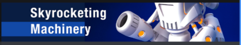
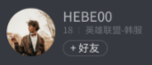

# 公共组件

> 这里放公共组件的演示


饿了吗UI的黑暗模式

[/demo](http://localhost:3000/demo)

其他公共组件

### 通栏图片 banner

> 右上角的广告,暂时是单个图片,链接
> 链接使用a标签新窗口打开

#### 参数

``` 
img 图片路径
url 链接
```




### 好友

> 1 名称\年龄\游戏区服\slot

